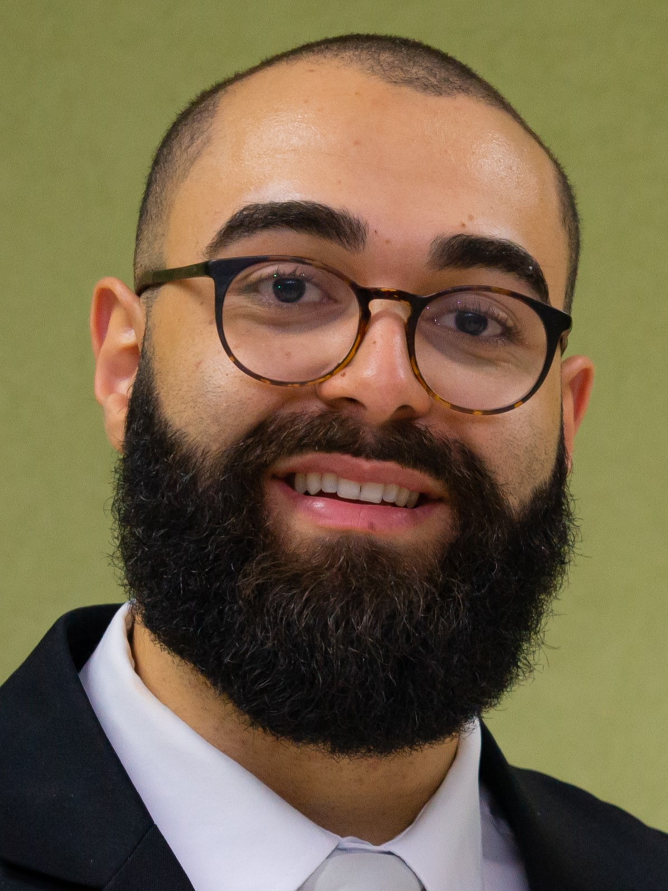

  
  
  # Hi, I'm Natthan Elias 👋

  **Computer Science Graduate | AI/ML Developer**

I am a backend-focused developer specializing in **Artificial Intelligence** and **Multi-Agent Systems**. With a background in Computer Science and ongoing studies in Psychology, I build intelligent, human-centric solutions using Large Language Models (LLMs).

Currently focused on bridging the gap between technical implementation and social impact.

### 🛠 Technical Stack

* **Languages:** Python, Node.js
* **AI/ML:** LLMs, LangChain, LangGraph, Google ADK, Multi-Agent Systems, PyTorch/TensorFlow
* **Cloud & Backend:** AWS, Microservices Architecture

### 🤝 Let's Connect

I am looking to network with fellow AI/ML engineers, tech leaders, and recruiters.

[LinkedIn](https://www.linkedin.com/in/natthan-elias/) • [Email](mailto:natthandosantos@gmail.com)
